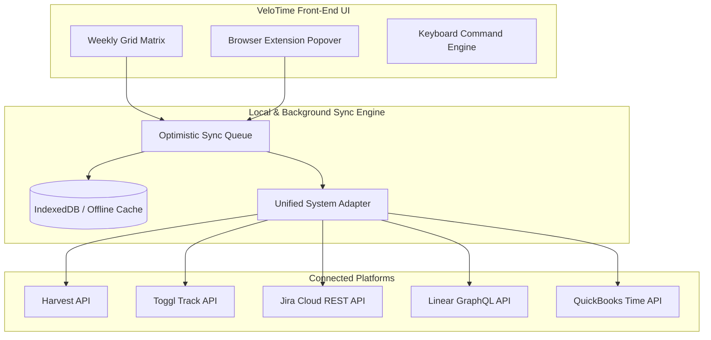
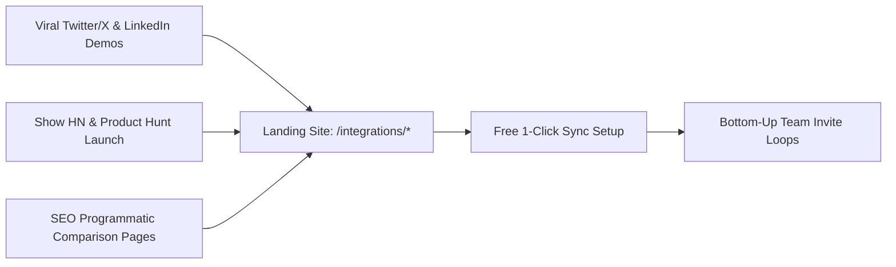

# VeloTime: Front-End Speed Layer — Implementation & Marketing Plan

> **Strategic Vision:**  
> Transform VeloTime from a standalone tracker into the **fastest, keyboard-first time logging front-end** that operates seamlessly on top of existing enterprise/legacy systems (Harvest, Toggl, Jira, Linear, QuickBooks, Asana).  
> *"Don't ask permission to switch timesheets. Just log your time 10x faster."*

---

## Part 1: Product & Technical Implementation Plan



### 1. Architectural Components to Build

#### A. Unified Integration Adapter Interface (`/src/services/integrations/`)
Build a standard adapter contract so adding new platforms takes hours, not weeks:
```typescript
interface TimeTrackingProvider {
  name: string; // 'harvest' | 'toggl' | 'jira' | 'linear'
  authenticate(credentials: Record<string, string>): Promise<boolean>;
  pullProjectsAndTasks(): Promise<{ projects: Project[]; tasks: Task[] }>;
  pushTimeEntry(entry: TimeEntry): Promise<{ externalId: string }>;
  updateTimeEntry(externalId: string, entry: TimeEntry): Promise<void>;
  deleteTimeEntry(externalId: string): Promise<void>;
}
```

#### B. Provider Connectors (Sprint 1: Toggl & Harvest)
1. **Toggl Track Connector:**
   - Auth via User API Token (no complex OAuth app registration needed for quick user testing).
   - Real-time two-way sync: entries logged in VeloTime push to Toggl in <200ms; changes made in Toggl reflect back on matrix refresh.
2. **Harvest Connector:**
   - Personal Access Token (PAT) + Account ID connection.
   - Syncs Daily/Weekly timesheets with project/task assignment.

#### C. In-App Sync Settings UI (`Settings -> Integrations`)
- Clean toggle switches for **Harvest**, **Toggl**, **Jira**, **Linear**.
- Real-time status indicator: `● Connected & Syncing (Last synced: 2m ago)`.
- Option to toggle **"Live Real-Time Sync"** vs **"End-of-Day Batch Push"**.

#### D. Zero-Latency Optimistic Sync Queue
- Time entries update instantly in VeloTime's UI with zero UI lag.
- Sync tasks queue in the background with automatic exponential retry and offline buffering (IndexedDB).

---

## Part 2: Go-To-Market & Marketing Plan

### 1. Positioning & Core Value Proposition

| Element | Legacy Framing | New "Front-End Speed Layer" Framing |
| :--- | :--- | :--- |
| **Hook** | "A better timesheet app for agencies." | **"Keep your company's time tracker. Log your time 10x faster."** |
| **Category** | Timesheet Software | **High-Velocity Time Entry Front-End (The "Superhuman of Timesheets")** |
| **Target User** | Agency Owner / CFO (Long B2B sales cycle) | **Individual Engineers, Designers, Consultants & PMs (Instant Bottom-Up Adoption)** |
| **Objection Handled** | *"Our company already mandates Harvest/Jira."* | *"Zero friction. Your company keeps Harvest/Jira; you just never have to look at their slow UI again."* |

---

### 2. Marketing Channels & Campaign Execution



#### A. Video-First Viral Demos (Twitter/X, LinkedIn, Reddit)
* **The "Side-by-Side Stopwatch" Video Campaign:**
  - Screen recording comparing logging 1 week of timesheets in Jira/Harvest (2 minutes of clicking, waiting for dropdowns to load) vs **VeloTime (18 seconds via keyboard tab/arrow matrix navigation)**.
  - Caption: *"Why does logging your hours in 2026 feel like using a Windows 95 form? We built VeloTime so you can log your whole week in under 20 seconds and sync it directly to Harvest/Jira."*

#### B. Programmatic SEO Landing Pages
Build dedicated SEO acquisition funnels on `velotime.dg.tools`:
- `velotime.dg.tools/integrations/harvest` — *"The Fast Keyboard UI for Harvest"*
- `velotime.dg.tools/integrations/toggl` — *"The Weekly Matrix Front-End for Toggl Track"*
- `velotime.dg.tools/integrations/jira` — *"Log Jira Worklogs in 10 Seconds Flat"*
- `velotime.dg.tools/integrations/linear` — *"Keyboard-First Time Entry for Linear Teams"*

#### C. Community Launchpad (Product Hunt & Hacker News)
- **Show HN:** *"Show HN: VeloTime – A keyboard-first speed layer for Harvest & Jira timesheets"*
  - Target the engineer/developer demographic that famously hates slow timesheet compliance on Friday afternoons.
- **Product Hunt Launch:** Positioned under *Productivity, Developer Tools, and Remote Work*.

#### D. The Bottom-Up Viral Loop (Team Expansion)
- When an employee invites a coworker or exports a summary, display:
  *"Logged via VeloTime Speed Layer. Want to finish your timesheet in 20 seconds? [Try VeloTime Free]"*

---

## Part 3: Execution Checklist for Tomorrow

- [ ] **Step 1:** Create `/src/services/integrations/` directory and build base `Adapter` engine.
- [ ] **Step 2:** Implement `TogglAdapter.js` (API key validation, project sync, time entry creation).
- [ ] **Step 3:** Implement `HarvestAdapter.js` (Personal token validation, daily time entry sync).
- [ ] **Step 4:** Add **"Connected Systems"** tab in Settings with 1-click test sync.
- [ ] **Step 5:** Build landing page banner & `/integrations/` route on `velotime-landing`.
