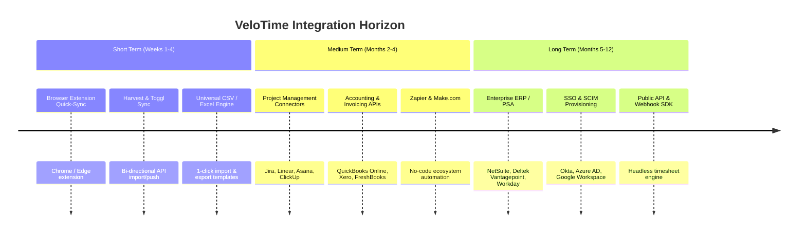

# VeloTime Integrations & Positioning Strategy

## 1. Strategic Positioning Analysis: "The High-Velocity Front-End Layer"

### The Core Hypothesis
> *"What if VeloTime's primary wedge is not forcing companies to rip-and-replace their backend accounting/timesheet systems, but serving as the lightning-fast, keyboard-driven interface that employees love, which automatically syncs into whatever system the company already mandates?"*

### Why This Positioning is a Massive Growth Unlock

| Dimension | Rip-and-Replace (Full ERP) | High-Velocity Front-End Layer (Overlay / Sync) |
| :--- | :--- | :--- |
| **Sales Cycle** | 3–9 months (Requires CFO, HR, IT, Payroll signoff) | **Hours or Days** (Individual teams or PMs can adopt without IT disruption) |
| **User Resistance** | High (Fear of migrating historical data & workflows) | **Zero** (Employees get speed, leadership gets their data) |
| **Competitive Threat** | Frontal war with Harvest, Toggl, QuickBooks, Deltek | **Complementary Tool** ("Superhuman for Time Tracking") |
| **Expansion Motion** | Top-Down only | **Bottom-Up Product-Led Growth (PLG)** |

### The "Superhuman / Linear" Analogy
* **Superhuman** didn't build an email server; it built the fastest keyboard-driven UI on top of Gmail and Outlook.
* **Linear** started by syncing seamlessly with GitHub issues before expanding into full project management.
* **VeloTime** can be the **ultra-fast time entry and matrix front-end** that pushes time into Jira, Harvest, QuickBooks, or Asana in milliseconds.

---

## 2. Integration Roadmap: Short, Medium & Long Term

---

### Phase 1: Short Term (Weeks 1 – 4) — *Frictionless Adoption & Instant Sync*

1. **Bi-Directional Toggl Track & Harvest API Sync:**
   - **Why:** Toggl and Harvest are the most common stand-alone trackers.
   - **How it works:**
     - User inputs their API token.
     - VeloTime automatically fetches active projects, clients, and tasks.
     - When time is entered in VeloTime's weekly matrix, it syncs instantly to Toggl/Harvest via background API workers.
2. **VeloTime Browser Extension (Chrome / Edge):**
   - Detects active tickets on Jira, Linear, GitHub, and Asana.
   - Allows 1-click logging directly to the VeloTime matrix without leaving the active tab.
3. **Universal Importer / Exporter:**
   - Pre-mapped CSV templates for QuickBooks Time (TSheets), BambooHR, ADP, and Rippling.

---

### Phase 2: Medium Term (Months 2 – 4) — *PM & Accounting Workflows*

1. **Project Management Ecosystem:**
   - **Jira Software & Linear:** Auto-import sprints, epics, and issues as VeloTime tasks. Logged hours automatically increment Jira worklogs (`timeSpent`).
   - **Asana & ClickUp:** Sync task lists and completion milestones into VeloTime project phases.
2. **Accounting & Invoicing Connectors:**
   - **QuickBooks Online & Xero:** 1-click export of VeloTime generated invoices and approved timesheet batches directly into Accounts Receivable / Payroll.
   - **FreshBooks:** Auto-sync client billing profiles and payment statuses.
3. **Zapier & Make.com Apps:**
   - Triggers: `New Time Entry`, `Timesheet Submitted`, `Invoice Paid`.
   - Actions: `Create Project`, `Create Task`, `Log Time Entry`.

---

### Phase 3: Long Term (Months 5 – 12) — *Enterprise Architecture & ERP Ecosystem*

1. **Architecture / Engineering PSA Integrations:**
   - **Deltek Vision / Vantagepoint & Core:** Architecture and engineering firms represent high-value enterprise contracts with heavy compliance needs. Direct phase-code and multiplier syncing.
2. **Enterprise ERP & Payroll:**
   - **NetSuite & Workday:** Automated weekly batch exports with GL code mapping.
3. **Public Developer API & Webhooks:**
   - Open REST & GraphQL endpoints with granular API keys and rate-limiting.
   - Enables internal IT teams to integrate custom proprietary billing systems.
